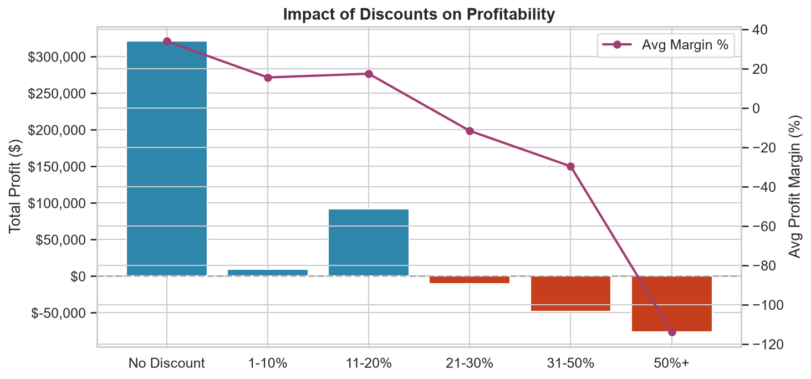
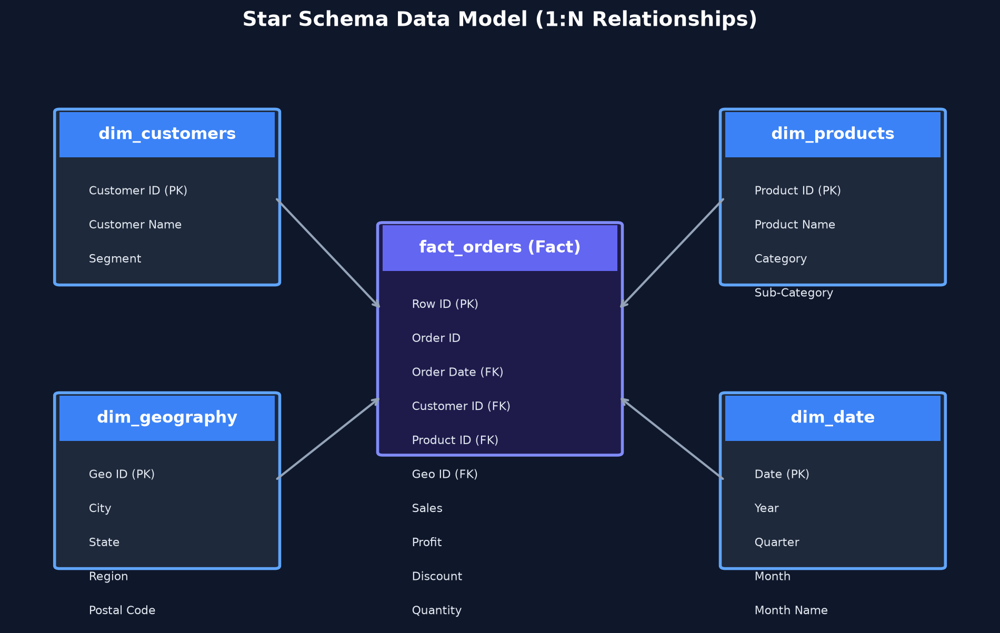

# E-Commerce Sales Analytics & Revenue Optimization (Power BI + SQL + Python)

> **Portfolio Project for Data Analyst & Business Intelligence Roles**  
> *Analyzed $2.30M in revenue across 9,994 orders to uncover profit leakage, RFM customer segments, and discount-driven margin erosion.*

[](https://powerbi.microsoft.com/)
[](https://www.python.org/)
[](sql/superstore_analysis.sql)
[](Superstore_Executive_Report.pdf)

---

## Executive Summary & Business Problem

Retail businesses often chase top-line revenue growth while unintentionally sacrificing profitability through unmonitored discounting, inefficient regional shipping, and poor product mix.

This project delivers an end-to-end Business Intelligence solution analyzing 4 years (2014–2017) of US nationwide retail data across **9,994 transaction records**, **793 customers**, and **1,862 SKUs**.

### Key Business Metrics & Growth

| Year | Revenue | YoY Growth | Profit | Profit Margin | Orders | Customers |
| :--- | :---: | :---: | :---: | :---: | :---: | :---: |
| **2014** | $484,247 | — | $49,544 | 10.2% | 969 | 284 |
| **2015** | $470,533 | -2.8% | $61,619 | 13.1% | 1,038 | 321 |
| **2016** | $609,206 | +29.5% | $81,795 | 13.4% | 1,315 | 454 |
| **2017 (Latest)** | **$733,215** | **+20.4%** | **$93,439** | **12.7%** | **1,687** | **693** |
| **Total** | **$2,297,201** | — | **$286,397** | **12.5%** | **5,009** | **793** |

---

## Strategic Business Insights

### 1. The Discount Profit Trap (Critical Finding)
* **No-Discount Orders:** Generate an average profit margin of **34.0%** (99.4% of orders are profitable).
* **Discounted Orders:** Average a **-8.3% margin** (only 63.3% of orders are profitable).
* **Impact:** Discounts exceeding **20%** consistently turn transactions into money-losing orders. Capping maximum discounts at 20% can recover an estimated **$138,515 in lost profit**.



### 2. Product Portfolio Rationalization
* **Technology** is the most profitable category (**$145,455 profit, 15.6% margin**).
* **Furniture** yields minimal profit (**$18,451 profit, 3.9% margin**).
* Three sub-categories operate at a net cumulative loss totaling **-$22,387**: **Tables (-$17.7K)**, **Bookcases (-$3.5K)**, and **Supplies (-$1.2K)**.

### 3. Geographic Loss Clusters
* **West Region** is the top performer (**$108,418 profit, 21.9% margin**).
* **Central Region** has a net negative margin (**-10.4%**) due to aggressive discounting in key states.
* **10 States operate at a net loss**, led by **Texas (-$25,729)**, **Ohio (-$16,971)**, and **Pennsylvania (-$15,560)**.

### 4. RFM Customer Segmentation
* **Champions (124 accounts):** Drive **$5,221 average revenue** per customer.
* **At-Risk & Hibernating (207 accounts):** Represent **~$600K in potential revenue at risk of churn**.

---

## Data Model Architecture (Star Schema)

To ensure high DAX query performance and scalable reporting, the relational data was modeled into a **Star Schema** consisting of **1 Fact Table** and **4 Dimension Tables**.



### Model Structure

* **`fact_orders`** (9,994 rows): Contains grain-level order line items (Sales, Profit, Quantity, Discount, Shipping Days).
* **`dim_customers`** (793 rows): Customer demographic data and segment categorization (Consumer, Corporate, Home Office).
* **`dim_products`** (1,862 rows): Product catalog (Category, Sub-Category, Product Name).
* **`dim_geography`** (632 locations): Geographic hierarchy (City, State, Region, Postal Code).
* **`dim_date`** (1,458 dates): Marked calendar table enabling Time Intelligence DAX measures.

---

## Core DAX Formulas

Below are key DAX measures engineered for the Power BI solution:

### 1. Revenue & Profitability Core Measures

```dax
-- Total Revenue
Total Revenue = SUM(fact_orders[Sales])

-- Total Profit
Total Profit = SUM(fact_orders[Profit])

-- Profit Margin %
Profit Margin % = DIVIDE([Total Profit], [Total Revenue], 0)

-- Loss Orders Count
Loss Orders = CALCULATE(DISTINCTCOUNT(fact_orders[Order ID]), fact_orders[Profit] < 0)

-- Potential Profit Recovery (from discounts > 20%)
Potential Profit Recovery = 
CALCULATE(
    SUM(fact_orders[Profit]),
    fact_orders[Discount] > 0.2,
    fact_orders[Profit] < 0
)
```

### 2. Time Intelligence (YoY Metrics)

```dax
-- Prior Year Revenue
Revenue PY = CALCULATE([Total Revenue], SAMEPERIODLASTYEAR(dim_date[Date]))

-- YoY Revenue Growth %
Revenue YoY Growth % = DIVIDE([Total Revenue] - [Revenue PY], [Revenue PY], 0)

-- Year to Date Revenue
Revenue YTD = TOTALYTD([Total Revenue], dim_date[Date])
```

### 3. Customer RFM & Segmentation

```dax
-- Repeat Purchase Rate %
Repeat Purchase Rate % = 
DIVIDE(
    CALCULATE(
        DISTINCTCOUNT(fact_orders[Customer ID]),
        FILTER(VALUES(fact_orders[Customer ID]), CALCULATE(DISTINCTCOUNT(fact_orders[Order ID])) >= 2)
    ),
    [Total Customers],
    0
)

-- Champions Count
Champions Count = 
CALCULATE(
    COUNTROWS(customer_rfm_analysis),
    customer_rfm_analysis[Customer Segment] = "Champions"
)
```

---

## Advanced SQL Analysis

The repository includes [`sql/superstore_analysis.sql`](sql/superstore_analysis.sql) featuring 20+ production-grade SQL queries demonstrating:

* **CTEs & Window Functions:** YoY revenue calculations using `LAG()` and customer ranking using `RANK()`.
* **RFM NTILE Bucketing:** Customer segmentation into 5 quintiles using `NTILE(5)`.
* **Cohort & Repeat Analysis:** Days between consecutive customer orders using `DATEDIFF()` and `LAG()`.
* **Conditional Aggregation:** Loss-rate percentages across discount tiers.

---

## Project Repository Structure

```
├── README.md                           # Master Portfolio Overview & Insights
├── Superstore_Executive_Report.pdf     # Downloadable Executive PDF Report
├── data/
│   ├── raw/                            # Source dataset (Sample - Superstore.csv)
│   └── cleaned/                        # Star Schema CSV exports for Power BI
│       ├── fact_orders.csv
│       ├── dim_customers.csv
│       ├── dim_products.csv
│       ├── dim_geography.csv
│       ├── dim_date.csv
│       └── customer_rfm_analysis.csv
├── powerbi/
│   ├── POWERBI_BUILD_GUIDE.md          # Click-by-click beginner Power BI guide
│   └── E-Commerce_Analytics_Dashboard.pbix # Interactive Power BI File
├── sql/
│   └── superstore_analysis.sql         # 20+ Advanced SQL Queries
├── scripts/
│   ├── 01_data_cleaning.py             # Python ETL Script (Data prep & Star schema)
│   ├── 02_eda_analysis.py              # Exploratory Analysis & Chart Generation
│   ├── generate_star_schema.py         # Model Diagram Generator
│   └── generate_pdf_report.py          # Executive PDF Generator
└── outputs/
    ├── charts/                         # 10 High-Res Analysis Charts & Models
    └── reports/                        # Text & PDF Executive Summaries
```

---

## How to Export PDF & Feature on Resume / LinkedIn

### 1. Generating Dashboard PDF from Power BI Desktop
1. Open `powerbi/E-Commerce_Analytics_Dashboard.pbix` in Power BI Desktop.
2. Go to **File → Export → Export to PDF**.
3. Save the exported PDF into the project root or include it in your portfolio application.

### 2. Resume Bullet Points

> **Data Analyst — E-Commerce Sales & Revenue Analytics Project**
> * Designed an end-to-end BI solution in **Power BI, SQL, and Python** analyzing **9,994 transactions ($2.30M revenue)** across 4 regions.
> * Modeled a **Star Schema architecture** (1 Fact, 4 Dimensions) and authored **30+ DAX measures** (YoY Time Intelligence, RFM Segmentation, Profit Margins).
> * Discovered margin erosion in discounted sales (**34.0% margin at 0% discount vs. -8.3% with discount**), identifying **$138.5K in recoverable profit**.
> * Formulated RFM customer segmentation model identifying 124 Champion accounts and **$600K in at-risk revenue**.
> * Authored 20+ advanced SQL queries utilizing **CTEs, Window Functions (`LAG`, `NTILE`), and Cohort logic**.

---

## License & Attribution

* **Dataset:** Sample - Superstore Dataset (Public Retail Data).
* **Author:** Data Analytics Portfolio Project.
* **License:** [MIT License](LICENSE) — free to use and reference.
